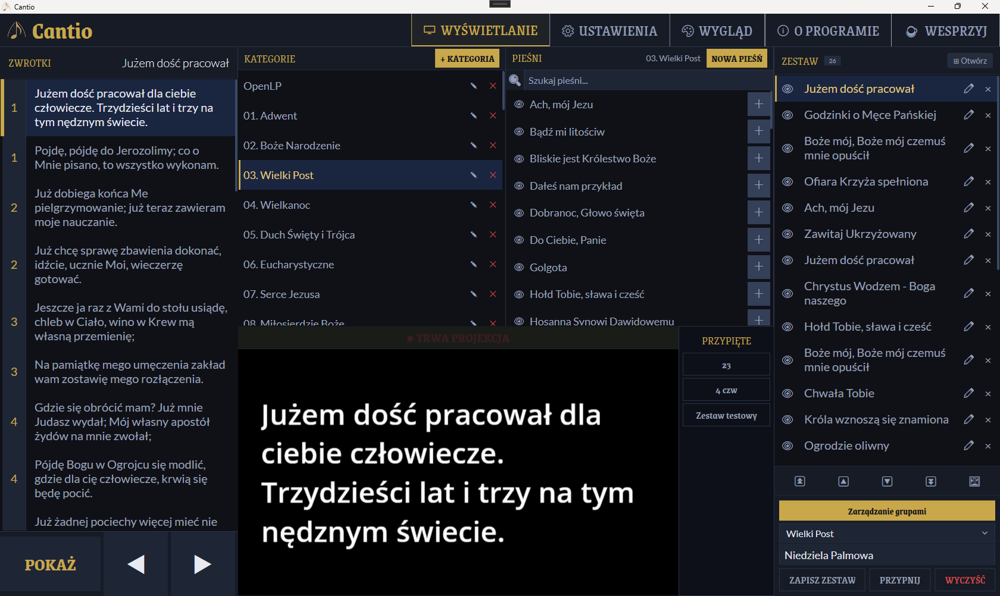

# Cantio

> Aplikacja do wyświetlania pieśni liturgicznych na projektorze podczas nabożeństw.
> A song display application for projecting liturgical music during church services.

---

## 🇵🇱 Polski

### O programie

Cantio to natywna aplikacja Windows do wyświetlania tekstu pieśni na ekranie projektora w kościele. Zaprojektowana z myślą o obsłudze dotykowej i wygodzie podczas nabożeństw.

### Funkcje

- Wyświetlanie tekstu pieśni na drugim ekranie / projektorze
- Automatyczny podział długich zwrotek na slajdy
- Automatyczne dopasowanie rozmiaru czcionki do ekranu
- Zestawy pieśni na nabożeństwo z grupowaniem i przeciąganiem
- **Obrazki w zestawie** — dodaj grafikę między pieśniami, wyświetla się pełnoekranowo
- Edytor pieśni z kategoriami i typami zwrotek (zwrotka, refren, bridge)
- Szybka edycja inline — bez opuszczania widoku sterowania, z natychmiastowym odświeżeniem projektora
- Tryb psalm — projektor wyświetla refren, kantor widzi zwrotkę w podglądzie
- Szablon projekcji — czcionka, kolory, tło, gradient, cień, marginesy
- Tagi formatowania tekstu z własną definicją i skrótami klawiaturowymi
- Import z OpenLP (SQLite, XML), OpenSong, OSZ
- Wielojęzyczny interfejs: Polski / English / Español
- Obsługa wielu monitorów
- Konfigurowalny zestaw skrótów klawiaturowych

### Wymagania

- Windows 10 / 11 (64-bit)
- Drugi ekran lub projektor (zalecane)

### Instalacja

Pobierz najnowszy instalator z sekcji [Releases](../../releases) i uruchom.
Podczas instalacji możesz wybrać czy chcesz zainstalować przykładową bazę pieśni, czy zacząć z pustą bazą.

### Układ interfejsu

| Kolumna | Zawartość |
|---|---|
| **Lewa** | Lista slajdów bieżącej pieśni + kontrolki (LIVE, Pokaż/Wygaś, ◀ ▶) |
| **Środkowa** | Kategorie i pieśni (góra) + miniatura podglądu (dół) |
| **Prawa** | Zestaw pieśni na nabożeństwo |

### Obsługa klawiatury

Skróty nawigacyjne są **konfigurowalne** w zakładce Ustawienia → Skróty.

| Klawisz | Akcja |
|---|---|
| `→` / `Spacja` | Następny slajd |
| `←` | Poprzedni slajd |
| `↑` / `↓` | Poprzednia / następna pieśń w zestawie |
| `Home` | Pierwszy slajd |
| `Esc` | Wygaś / Pokaż ekran |
| `Ctrl+F` | Skocz do wyszukiwarki pieśni |

### Budowanie ze źródeł

\`\`\`bash
# Wymagania: .NET 10 SDK
git clone https://github.com/CSnipper/cantio-app.git
cd cantio-app
dotnet run --project Cantio
\`\`\`

Budowanie instalatora (wymaga Inno Setup 6):
\`\`\`bash
cd Installer
powershell -ExecutionPolicy Bypass -File build-installer.ps1
\`\`\`

---

## 🇬🇧 English

### About

Cantio is a native Windows application for displaying song lyrics on a projector screen during church services. Designed for touch-friendly operation and ease of use during worship.

### Features

- Song text display on a secondary screen / projector
- Automatic splitting of long verses into slides
- Automatic font size fitting to screen dimensions
- Song sets for services with group management and drag & drop reordering
- **Images in set** — insert graphics between songs, displayed full-screen on the projector
- Song editor with categories and verse types (verse, chorus, bridge)
- Quick inline editor — edit without leaving the display view, projector updates instantly on save
- Psalm mode — projector shows the chorus, cantor sees the current verse in the preview
- Projection template — font, colors, background, gradient, shadow, margins
- Custom format tags with keyboard shortcuts
- Import from OpenLP (SQLite, XML), OpenSong, OSZ
- Multilingual UI: Polski / English / Español
- Multi-monitor support
- Fully configurable keyboard shortcuts

### Requirements

- Windows 10 / 11 (64-bit)
- Secondary screen or projector (recommended)

### Installation

Download the latest installer from the [Releases](../../releases) section and run it.
During installation you can choose between a sample song database or an empty one.

### Interface layout

| Column | Content |
|---|---|
| **Left** | Slide list for the current song + controls (LIVE, Show/Blank, ◀ ▶) |
| **Center** | Categories and songs (top) + slide preview thumbnail (bottom) |
| **Right** | Set list — songs queued for the service |

### Keyboard shortcuts

Navigation shortcuts are **configurable** in Settings → Shortcuts.

| Key | Action |
|---|---|
| `→` / `Space` | Next slide |
| `←` | Previous slide |
| `↑` / `↓` | Previous / next song in set |
| `Home` | First slide |
| `Esc` | Blank / Show screen |
| `Ctrl+F` | Focus song search box |

### Building from source

\`\`\`bash
# Requires: .NET 10 SDK
git clone https://github.com/CSnipper/cantio-app.git
cd cantio-app
dotnet run --project Cantio
\`\`\`

Building the installer (requires Inno Setup 6):
\`\`\`bash
cd Installer
powershell -ExecutionPolicy Bypass -File build-installer.ps1
\`\`\`

---

## Stack

- C# 12 / .NET 10 / WPF
- CommunityToolkit.Mvvm
- Entity Framework Core + SQLite
- WpfScreenHelper

## License

MIT
